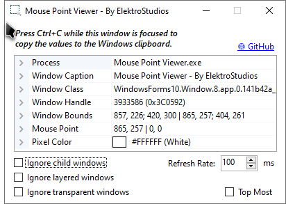

<!-- Common Project Tags:
desktop-app 
desktop-application 
dotnet 
netframework 
netframework48 
tool 
tools 
vbnet 
visualstudio 
windows 
windows-app 
windows-application 
windows-applications 
windows-forms 
winforms 
 -->

  
  
  <h1>Mouse Point Viewer</h1>

### A desktop application that displays mouse coordinates relative to any window visible on the screen.

------------------

    &nbsp;
    &nbsp;
    &nbsp;
    
    &nbsp;
    
   
   
    
    
    
    
    
    
   
    
    
    
    
    
    
   
   
    

------------------

## 👋 Introduction

This utility tracks and displays the exact real-time coordinates of your mouse cursor relative to the boundaries of any window visible on your screen.

## 💡 Motivation

If you have ever tried to figure out the exact position of a button, image, or UI element inside an application window, you know how annoying it is. Global screen coordinates are useless because the moment you move or resize that application window, all your pixel measurements are ruined, and you have to start guessing or doing pixel math in your head. 

I was tired of dealing with that exact friction, so I built this humble utility to do one practical thing: give you the real, relative coordinates instantly. It saves time, saves headaches, and just works.

##### ⚡ The Real Question
###### Why spend time manually calculating pixel offsets relative to application windows when you can map coordinates directly to any active handle on your screen with a lightweight utility?.

## 🖼️ Screenshots

## 📝 Requirements

- Microsoft Windows OS.

## 🚀 Getting Started

1. Navigate to the **[Releases page](https://github.com/ElektroStudios/Mouse-Point-Viewer/releases/latest)**.
2. Download the latest `.zip` archive or the `.exe` setup installer, depending on your preference.
3. If you downloaded the `.zip` archive, extract its contents to your preferred directory.
     
   If you downloaded the `.exe` file, run it and follow the installation wizard.
4. Run the executable file to launch the application.

## 🔄 Change Log

Explore the complete list of changes, bug fixes, and improvements across different releases by clicking [here](/Docs/CHANGELOG.md).

## 💪 Contributing

Your contribution is highly appreciated!. If you have any ideas, suggestions, or encounter issues, feel free to open an issue by clicking [here](https://github.com/ElektroStudios/Mouse-Point-Viewer/issues/new/choose). 

Your input helps make this Work better for everyone. Thank you for your support! 🚀

## 💰 Beyond Contribution

This work is distributed for educational purposes and without any profit motive. However, if you find value in my efforts and wish to support and motivate my ongoing work, you may consider contributing financially through the following options:

| Platform | How to Support |
| :---: | :--- |
|  | **[Become my sponsor on GitHub](https://github.com/sponsors/ElektroStudios/)** You can show me your support by contributing any amount you prefer, and unlocking rewards! |
|  | **[Make a PayPal Donation](https://www.paypal.com/cgi-bin/webscr?cmd=_s-xclick&hosted_button_id=E4RQEV6YF5NZY)** You can donate to me any amount you like via PayPal. |
|  | **[Purchase my software at Envato's CodeCanyon](https://codecanyon.net/item/elektrokit-class-library-for-net/19260282)** If you are a .NET developer, you may want to explore **DevCase Class Library for .NET**, a huge set of APIs I have on sale. *It also contains all pieces of reusable code that you can find across the source code of my open-source works.* |

 

  <b>Your support means the world to me! Thank you for considering it! 🤗💗</b>

------------------

## ⚠️ Disclaimer

This software and its associated repository are provided strictly on an "as is" basis, without warranties of any kind, whether express or implied. This includes, but is not limited to, any implied warranties of merchantability, reliability, or fitness for a particular purpose.

The authors and copyright holders assume no liability for any direct, indirect, incidental, or consequential damages—including data loss or system errors—arising from the use, misuse, or inability to use this software. You are solely responsible for determining the appropriateness of using this tool and assume all associated risks.

Furthermore, this project operates entirely independently. The utilization of any third-party libraries or components within this software does not imply any affiliation with, or endorsement or approval by, their respective original authors.

By using this software, you agree to indemnify and hold harmless the authors from any claims, damages, or liabilities arising from your use or misuse of it.

This project is licensed under the **Apache License, Version 2.0**. See the  [License](./LICENSE) file for details.
